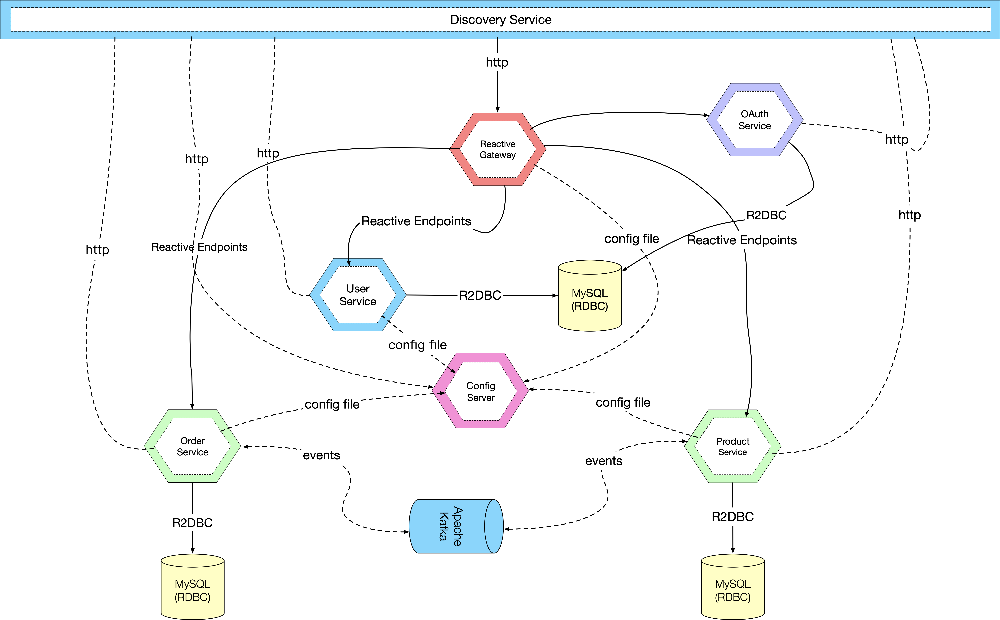

[TOC]

#  微服务系统设计

> “微服务就是一些协同工作的小而自治的服务，微服务很小，只专注做好一件事。一个微服务就是一个独立的实体，它可以独立的部署在`PAAS(Platform As A Service)`上，也可以作为一个操作系统进程存在。”

微服务系统基于`spring cloud`、`docker`和`kubernetes`进行构建，主要包括`api-gateway`（服务网关）、`config-repo`（配置中心）、`eureka-server`（服务发现）、`oauth-service`(授权服务)以及`order-service`、`product-service`、`user-service`共7个微服务，其应用场景围绕用户购买商品并进行支付订单。对于单体系统演化到微服务系统，从中寻找业务边界并进行服务拆分，有很多值得深入思考的问题。

## 服务整体设计图

下图以一种更直观的方式展示了服务之间的调用关系，具体描述了从`Reactive Gateway`到具体服务以及后端的数据源`Datasource`间的调用流程：

